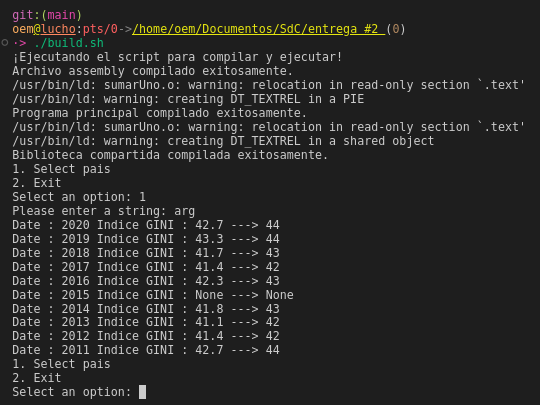

# Entrega 2


### Resumen de ejecuciones
```bash
#ejemplo c y python
./build_c_python.sh

#enlazar c, python y asm
./build.sh

#debug con gdb
./build_with_gdb.sh
```



### Práctico paso a paso


### Consumir una API REST desde python

Para escribir código que interactúe con las API REST, en Python se recurre a requests para enviar solicitudes HTTP. Esta biblioteca abstrae las complejidades de realizar solicitudes HTTP. Y se puede tratar como si fuera parte de la biblioteca estándar. Para instalarla depende en como tratemos python en nuestro sistema, por ejemplo:

```shell
python -m pip install requests
```


Ejemplo:

```python
import requests

url = "https://api.worldbank.org/v2/en/country/AFR/indicator/SI.POV.GINI?format=json&date=2011:2020&per_page=32500&page=1"
response = requests.get(url)
data = response.json()
print(data)
```

### Llamar codigo C desde python

Supongamos un ejemplo de suma

```c
/*          suma.c          */

#include <stdio.h>

int _suma(float index) {
       int index_gini=(int) index;
       return index_gini+1;
}
```

```python
#      req.py      

import ctypes
 
# Cargamos la libreria
libsuma = ctypes.CDLL('./libsuma.so')
 
# Definimos los tipos de los argumentos de la función suma
 
libsuma._suma.argtypes = [ctypes.c_float]
 
# Definimos el tipo del retorno de la función suma
libsuma._suma.restype = ctypes.c_int
 
# Creamos nuestra función suma en Python
# hace de Wrapper para llamar a la función de C
def get_suma(num):
    print(libsuma._suma(num))

# Llamamos a la función suma
get_suma(5.0)
```
Creamos el objeto y asociamos como libreria dinamica y ya podemos ejecutar
```bash
gcc -c suma.c -o suma.o
gcc -shared -W -o libsuma.o suma.o
python3 ejemplosuma.py
```

### Assembler enlazado a C + Python

```asm
section .data
    num dd 0

global asm_main
section .text

asm_main:
    push ebp
    mov ebp, esp
    fld dword [esp + 8]
    fistp dword[num]
    mov eax, [num]
    add eax, 1
    mov [num], eax
    mov esp, ebp
    pop ebp
    ret
```

```c
extern int asm_main(float);

/**
 * Adds one to the given number.
 *
 * @param n The number to which one will be added.
 * @return The result of adding one to the given number.
 */
int sumar_uno(float n) {
    int res = asm_main(n);
    return res;
}

```

```c
/*              includes                */
#include <stdio.h>
#include "sumarUno.c"


/**
 * @brief Adds one to a given floating-point number.
 * @return The result of adding one to the given number.
 */
int main() {
    float numero;
    int resultado;

    printf("Ingrese un número flotante: ");
    scanf("%f", &numero);

    resultado = sumar_uno(numero);

    printf("Resultado: %d\n", resultado);

    return 0;
}

```

```python
import requests
import json
import ctypes

# Load the shared library
libsuma = ctypes.CDLL('./libsuma.so')

# Configure argument and return types
libsuma.add_one.argtypes = [ctypes.c_float]
libsuma.add_one.restype = ctypes.c_int

def show_menu():
    print("1. Select pais")
    print("2. Exit")

def get_url(country):
    url = "https://api.worldbank.org/v2/en/country/{}/indicator/SI.POV.GINI?format=json&date=2011:2020&per_page=32500&page=1".format(country)
    return url

def get_suma(num):
    return libsuma.add_one(num)

def option_1():
    country = raw_input("Please enter a string: ")  # For Python 2.7, use raw_input instead of input
    url = get_url(country)
    response = requests.get(url)
    data = response.json()
    elementos = data[1]
    for elem in elementos:
        element = elem.get('value')
        num = get_suma(element) if element is not None else "None"
        dat = elem.get('date')
        print("Date : {} Indice GINI : {} ---> {}".format(dat, element, num))

while True:
    show_menu()
    option = raw_input("Select an option: ")  # For Python 2.7, use raw_input instead of input

    if option == "1":
        option_1()
    elif option == "2":
        print("Exiting the program...")
        break
    else:
        print("Invalid option")


```

Para ejecutar esto podemos seguir los pasos de ./build.sh
```bash
#!/bin/bash

# Imprimir un mensaje de inicio
printf "¡Ejecutando el script para compilar y ejecutar!\n"

# Compilar el archivo assembly
nasm -f elf32 sumarUno.asm -o sumarUno.o

# Imprimir un mensaje intermedio
printf "Archivo assembly compilado exitosamente.\n"

# Compilar el archivo C principal
gcc -o result sumarUno.o main.c -m32  

# Imprimir un mensaje intermedio
printf "Programa principal compilado exitosamente.\n"

# Compilar la biblioteca compartida
gcc -shared -W -o libsuma.so sumarUno.c sumarUno.o -m32

# Imprimir un mensaje final
printf "Biblioteca compartida compilada exitosamente.\n"

# Ejecutar el script de Python
python2.7 giny.py

# Imprimir un mensaje de finalización
printf "¡Script completado con éxito!\n"
```

## Para el debug y observar con gdb hacemos
```bash

(gdb) break main
Breakpoint 1 at 0x1227: file main.c, line 11.
(gdb) break sumar_uno 
Breakpoint 2 at 0x11ef: file /home/oem/Documentos/SdC/entrega #2/sumarUno.c, line 11.
(gdb) break asm_main 
Breakpoint 3 at 0x11c0: file sumarUno.asm, line 12.
(gdb) run
Starting program: /home/oem/Documentos/SdC/entrega #2/result 
[Thread debugging using libthread_db enabled]
Using host libthread_db library "/lib/x86_64-linux-gnu/libthread_db.so.1".

Breakpoint 1, main () at main.c:11
11      int main() {
(gdb) continue
Continuing.
Ingrese un número flotante: 3.14

Breakpoint 2, sumar_uno (n=3.1400001) at /home/oem/Documentos/SdC/entrega #2/sumarUno.c:11
11          int res = asm_main(n);
(gdb) info registers 
eax            0x56558fd0          1448447952
ecx            0xffffce18          -12776
edx            0x0                 0
ebx            0x56558fd0          1448447952
esp            0xffffcdf0          0xffffcdf0
ebp            0xffffce08          0xffffce08
esi            0xffffcf04          -12540
edi            0xf7ffcb80          -134231168
eip            0x565561ef          0x565561ef <sumar_uno+17>
eflags         0x212               [ AF IF ]
cs             0x23                35
ss             0x2b                43
ds             0x2b                43
es             0x2b                43
fs             0x0                 0
gs             0x63                99
(gdb) x/16xw $esp
0xffffcdf0:     0xf7f98620      0x56557026      0xffffce14      0x00000002
0xffffce00:     0xf7fc4540      0x56558fd0      0xffffce38      0x5655626c
0xffffce10:     0x4048f5c3      0xffffce24      0xf7d864be      0x56556221
0xffffce20:     0xffffce60      0x4048f5c3      0xf7fbeb40      0x6f36cc00
(gdb) continue
Continuing.

Breakpoint 3, asm_main () at sumarUno.asm:12
12          push ebp
(gdb) info registers 
eax            0x56558fd0          1448447952
ecx            0xffffce18          -12776
edx            0x0                 0
ebx            0x56558fd0          1448447952
esp            0xffffcddc          0xffffcddc
ebp            0xffffce08          0xffffce08
esi            0xffffcf04          -12540
edi            0xf7ffcb80          -134231168
eip            0x565561c0          0x565561c0 <asm_main>
eflags         0x296               [ PF AF SF IF ]
cs             0x23                35
ss             0x2b                43
ds             0x2b                43
es             0x2b                43
fs             0x0                 0
gs             0x63                99
(gdb) x/16xw $esp
0xffffcddc:     0x565561fc      0x4048f5c3      0xf7ffcb80      0xffffce38
0xffffcdec:     0x565561ea      0xf7f98620      0x56557026      0xffffce14
0xffffcdfc:     0x00000002      0xf7fc4540      0x56558fd0      0xffffce38
0xffffce0c:     0x5655626c      0x4048f5c3      0xffffce24      0xf7d864be
(gdb) continue
Continuing.
Resultado: 4
```

Análisis del Stack
- Antes de llamar a sumar_uno:
El stack y los registros muestran el estado inicial antes de entrar en la función sumar_uno. Aquí se observan direcciones de memoria y valores de registros generales.

- Dentro de sumar_uno:
El stack contiene la dirección de retorno, el argumento n pasado a sumar_uno, y otros valores temporales. El registro esp apunta a la parte superior del stack.

- Dentro de asm_main:
Se observa una reducción en el valor de esp ya que se empuja ebp y otros valores al stack. El registro eax eventualmente contendrá el valor de num incrementado en 1 antes de ser retornado a sumar_uno.
