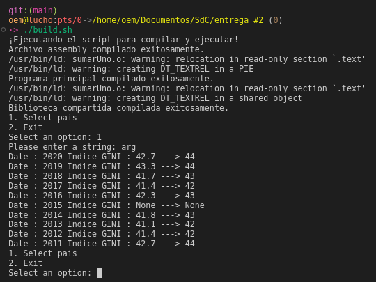
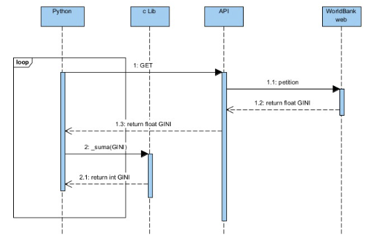
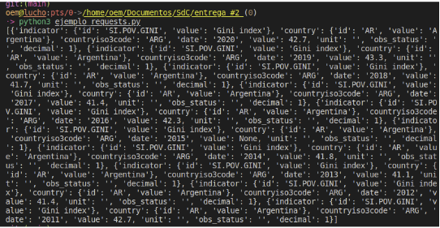

# Universidad Nacional de Córdoba
## FCEFyN - Sistemas de Computación 2024
## _Entrega #2: Modo Protegido_

Autores:
- Mangin, Matias Eduardo.
- Robles, Karen Yésica.
- Rodriguez, Luciano Ariel


## Índice

- [Resumen de ejecuciones](#resumen-de-ejecuciones)
- [Enunciado](#enunciado)
- [Marco teórico](#marco-teórico)
- [Desarrollo Práctico](#desarrollo-práctico)
- [Consumir una API REST desde python](#consumir-una-api-rest-desde-python)
- [Llamar codigo C desde python](#llamar-codigo-c-desde-python)
- [Assembler enlazado a C y Python](#assembler-enlazado-a-c-y-python)
- [Debug con gdb](#debug-con-gdb)
- [Anexo Python](#anexo-python)
- [Conclusión](#conclusión)


        


### Resumen de ejecuciones
```bash
#ejemplo c y python
./build_c_python.sh

#enlazar c, python y asm
./build.sh

#debug con gdb
./build_with_gdb.sh
```


### Enunciado

Diseñar e implementar cálculos en ensamblador. La capa superior recuperará información de una api REST. Se recomienda el uso de API Rest y python. Los datos de consulta realizados deben ser entregados a un programa en C que convocará rutinas en ensamblador para que hagan los cálculos de conversión y devuelvan los resultados a las capas superiores. Luego el programa en C o python mostrará los cálculos obtenidos.
Se debe utilizar el stack para convocar, enviar parámetros y devolver resultados. O sea utilizar las convenciones de llamadas de lenguajes de alto nivel a bajo nivel.
Se debe diseñar e implementar una interfaz que muestre el índice GINI. La capa superior recuperará la información del banco mundial https://api.worldbank.org/v2/en/country/all/indicator/SI.POV.GINI?format=json&date=2011:2020&per_page=32500&page=1&country=%22Argentina%22.  Se recomienda el uso de API Rest y Python. Los datos de consulta realizados deben ser entregados a un programa en C (capa intermedia) que convocará rutinas en ensamblador para que hagan los cálculos de conversión de float a enteros y devuelva el índice de un país como Argentina u otro sumando uno (+1). Luego el programa en C o python mostrará los datos obtenidos.-
Se debe utilizar el stack para convocar, enviar parámetros y devolver resultados. O sea utilizar las convenciones de llamadas de lenguajes de alto nivel a bajo nivel.-
En una primera iteración resolverán todo el trabajo práctico usando c con python sin ensamblador. En la siguiente iteración usarán los conocimientos de ensamblador para completar el tp.
IMPORTANTE: en esta segunda iteración deberán mostrar los resultados con gdb, para ello pueden usar un programa de C puro. Cuando depuren muestran el estado del área de memoria que contiene el stack antes, durante y después de la función.

### Marco teórico
#### _API REST_
Una API de REST, o API de RESTful, es una interfaz de programación de aplicaciones (API o API web) que se ajusta a los límites de la arquitectura REST y permite la interacción con los servicios web de RESTful. El informático Roy Fielding es el creador de la transferencia de estado representacional (REST).
Las API son conjuntos de definiciones y protocolos que se utilizan para diseñar e integrar el software de las aplicaciones. Suele considerarse como el contrato entre el proveedor de información y el usuario, donde se establece el contenido que se necesita por parte del consumidor (la llamada) y el que requiere el productor (la respuesta).
Las API le permiten interactuar con una computadora o un sistema para obtener datos o ejecutar una función, de manera que el sistema comprenda la solicitud y la cumpla.
#### _API de Python y REST : interacción con servicios web_
Hay muchos servicios web , como YouTube y GitHub, que hacen que sus datos sean accesibles para aplicaciones de terceros a través de una interfaz de programación de aplicaciones (API) . Una de las formas más populares de crear API es el estilo de arquitectura REST . Python proporciona herramientas no solo para obtener datos de las API REST sino también para crear sus propias API REST de Python.
Al utilizar las API Python y REST, se puede recuperar, analizar, actualizar y manipular los datos proporcionados por cualquier servicio web de interés.
#### _API REST y servicios web_
Un servicio web REST es cualquier servicio web que cumple con las restricciones de la arquitectura REST. Estos servicios web exponen sus datos al mundo exterior a través de una API. Las API REST brindan acceso a datos de servicios web a través de URL web públicas.
##### Métodos HTTP
Las API REST reciben métodos HTTP como GET, POST y  DELETE para saber qué operaciones realizar en los recursos del servicio web. Un recurso es cualquier dato disponible en el servicio web al que se puede acceder y manipular con solicitudes HTTP a la API REST. El método HTTP le dice a la API qué acción realizar en el recurso.
Si bien existen muchos métodos HTTP, los cinco métodos que se enumeran a continuación son los más utilizados con las API REST:

| Método HTTP | Descripción                                   |
|-------------|-----------------------------------------------|
| GET         | Recuperar un recurso existente.               |
| POST        | Crear un nuevo recurso.                       |
| PUT         | Actualizar un recurso existente.              |
| PATCH       | Actualizar parcialmente un recurso existente. |
| DELETE      | Eliminar un recurso.                          |

Una aplicación cliente de API REST puede utilizar estos cinco métodos HTTP para gestionar el estado de los recursos en el servicio web.
##### Códigos de estado
Una vez que una API REST recibe y procesa una solicitud HTTP, devolverá una respuesta HTTP . En esta respuesta se incluye un código de estado HTTP . Este código proporciona información sobre los resultados de la solicitud. Una aplicación que envía solicitudes a la API puede verificar el código de estado y realizar acciones según el resultado. Estas acciones podrían incluir manejar errores o mostrar un mensaje de éxito a un usuario.
A continuación se muestra una lista de los códigos de estado más comunes devueltos por las API REST:

| Código | Significado                   | Descripción                                                                            |
|--------|-------------------------------|----------------------------------------------------------------------------------------|
| 200    | DE ACUERDO                    | La acción solicitada fue exitosa.                                                      |
| 201    | Creado                        | Se creó un nuevo recurso.                                                              |
| 202    | Aceptado                      | Se recibió la solicitud, pero aún no se ha realizado ninguna modificación.             |
| 204    | Sin contenido                 | La solicitud fue exitosa, pero la respuesta no tiene contenido.                        |
| 400    | Solicitud incorrecta          | La solicitud estaba mal formada.                                                       |
| 401    | No autorizado                 | El cliente no está autorizado a realizar la acción solicitada.                         |
| 404    | Extraviado                    | No se encontró el recurso solicitado.                                                  |
| 415    | Tipo de medio no admitido     | El formato de datos de la solicitud no es compatible con el servidor.                  |
| 422    | Entidad no procesable         | Los datos de la solicitud estaban formateados correctamente pero contenían datos no válidos o faltantes. |
| 500    | Error Interno del Servidor    | El servidor arrojó un error al procesar la solicitud.                                  |

### Requerimientos

- Sistema Operativo Linux.
- Editor de texto como Codium o Sublime Text cualquier otro editor.
- Netwide Assembler: Ensamblador libre para X86.
- Linkeditor, generalmente viene instalado por default en el SO.
- Compilador de lenguaje C, también viene instalado por default
- Depurador


### Desarrollo Práctico
Para la primera fase del proyecto (antes de la implementación del ensamblador), se ha elaborado el siguiente diagrama de secuencias. Este diagrama es fundamental para comprender el flujo de interacción entre los diferentes componentes del sistema en esta etapa inicial del desarrollo. Además de proporcionar una visión clara de cómo se comunican los distintos elementos del software:




### Consumir una API REST desde python

Para escribir código que interactúe con las API REST, en Python se recurre a requests para enviar solicitudes HTTP. Esta biblioteca abstrae las complejidades de realizar solicitudes HTTP. Y se puede tratar como si fuera parte de la biblioteca estándar. Para instalarla depende en como tratemos python en nuestro sistema, por ejemplo:

```shell
python -m pip install requests
```


Ejemplo:

```python
import requests

url = "https://api.worldbank.org/v2/en/country/AFR/indicator/SI.POV.GINI?format=json&date=2011:2020&per_page=32500&page=1"
response = requests.get(url)
data = response.json()
print(data)
```


### Llamar codigo C desde python

Supongamos un ejemplo de suma

```c
/*          suma.c          */

#include <stdio.h>

int _suma(float index) {
       int index_gini=(int) index;
       return index_gini+1;
}
```

```python
#      req.py      

import ctypes
 
# Cargamos la libreria
libsuma = ctypes.CDLL('./libsuma.so')
 
# Definimos los tipos de los argumentos de la función suma
 
libsuma._suma.argtypes = [ctypes.c_float]
 
# Definimos el tipo del retorno de la función suma
libsuma._suma.restype = ctypes.c_int
 
# Creamos nuestra función suma en Python
# hace de Wrapper para llamar a la función de C
def get_suma(num):
    print(libsuma._suma(num))

# Llamamos a la función suma
get_suma(5.0)
```
Creamos el objeto y asociamos como libreria dinamica y ya podemos ejecutar
```bash
gcc -c suma.c -o suma.o
gcc -shared -W -o libsuma.o suma.o
python3 ejemplosuma.py
```

### Assembler enlazado a C y Python

```asm
section .data
    num dd 0

global asm_main
section .text

asm_main:
    push ebp
    mov ebp, esp
    fld dword [esp + 8]
    fistp dword[num]
    mov eax, [num]
    add eax, 1
    mov [num], eax
    mov esp, ebp
    pop ebp
    ret
```

```c
extern int asm_main(float);

/**
 * Adds one to the given number.
 *
 * @param n The number to which one will be added.
 * @return The result of adding one to the given number.
 */
int sumar_uno(float n) {
    int res = asm_main(n);
    return res;
}

```

```c
/*              includes                */
#include <stdio.h>
#include "sumarUno.c"


/**
 * @brief Adds one to a given floating-point number.
 * @return The result of adding one to the given number.
 */
int main() {
    float numero;
    int resultado;

    printf("Ingrese un número flotante: ");
    scanf("%f", &numero);

    resultado = sumar_uno(numero);

    printf("Resultado: %d\n", resultado);

    return 0;
}

```

```python
import requests
import json
import ctypes

# Load the shared library
libsuma = ctypes.CDLL('./libsuma.so')

# Configure argument and return types
libsuma.add_one.argtypes = [ctypes.c_float]
libsuma.add_one.restype = ctypes.c_int

def show_menu():
    print("1. Select pais")
    print("2. Exit")

def get_url(country):
    url = "https://api.worldbank.org/v2/en/country/{}/indicator/SI.POV.GINI?format=json&date=2011:2020&per_page=32500&page=1".format(country)
    return url

def get_suma(num):
    return libsuma.add_one(num)

def option_1():
    country = raw_input("Please enter a string: ")  # For Python 2.7, use raw_input instead of input
    url = get_url(country)
    response = requests.get(url)
    data = response.json()
    elementos = data[1]
    for elem in elementos:
        element = elem.get('value')
        num = get_suma(element) if element is not None else "None"
        dat = elem.get('date')
        print("Date : {} Indice GINI : {} ---> {}".format(dat, element, num))

while True:
    show_menu()
    option = raw_input("Select an option: ")  # For Python 2.7, use raw_input instead of input

    if option == "1":
        option_1()
    elif option == "2":
        print("Exiting the program...")
        break
    else:
        print("Invalid option")


```

Para ejecutar esto podemos seguir los pasos de ./build.sh
```bash
#!/bin/bash

# Imprimir un mensaje de inicio
printf "¡Ejecutando el script para compilar y ejecutar!\n"

# Compilar el archivo assembly
nasm -f elf32 sumarUno.asm -o sumarUno.o

# Imprimir un mensaje intermedio
printf "Archivo assembly compilado exitosamente.\n"

# Compilar el archivo C principal
gcc -o result sumarUno.o main.c -m32  

# Imprimir un mensaje intermedio
printf "Programa principal compilado exitosamente.\n"

# Compilar la biblioteca compartida
gcc -shared -W -o libsuma.so sumarUno.c sumarUno.o -m32

# Imprimir un mensaje final
printf "Biblioteca compartida compilada exitosamente.\n"

# Ejecutar el script de Python
python2.7 giny.py

# Imprimir un mensaje de finalización
printf "¡Script completado con éxito!\n"
```

### Debug con gdb
```bash

(gdb) break main
Breakpoint 1 at 0x1227: file main.c, line 11.
(gdb) break sumar_uno 
Breakpoint 2 at 0x11ef: file /home/oem/Documentos/SdC/entrega #2/sumarUno.c, line 11.
(gdb) break asm_main 
Breakpoint 3 at 0x11c0: file sumarUno.asm, line 12.
(gdb) run
Starting program: /home/oem/Documentos/SdC/entrega #2/result 
[Thread debugging using libthread_db enabled]
Using host libthread_db library "/lib/x86_64-linux-gnu/libthread_db.so.1".

Breakpoint 1, main () at main.c:11
11      int main() {
(gdb) continue
Continuing.
Ingrese un número flotante: 3.14

Breakpoint 2, sumar_uno (n=3.1400001) at /home/oem/Documentos/SdC/entrega #2/sumarUno.c:11
11          int res = asm_main(n);
(gdb) info registers 
eax            0x56558fd0          1448447952
ecx            0xffffce18          -12776
edx            0x0                 0
ebx            0x56558fd0          1448447952
esp            0xffffcdf0          0xffffcdf0
ebp            0xffffce08          0xffffce08
esi            0xffffcf04          -12540
edi            0xf7ffcb80          -134231168
eip            0x565561ef          0x565561ef <sumar_uno+17>
eflags         0x212               [ AF IF ]
cs             0x23                35
ss             0x2b                43
ds             0x2b                43
es             0x2b                43
fs             0x0                 0
gs             0x63                99
(gdb) x/16xw $esp
0xffffcdf0:     0xf7f98620      0x56557026      0xffffce14      0x00000002
0xffffce00:     0xf7fc4540      0x56558fd0      0xffffce38      0x5655626c
0xffffce10:     0x4048f5c3      0xffffce24      0xf7d864be      0x56556221
0xffffce20:     0xffffce60      0x4048f5c3      0xf7fbeb40      0x6f36cc00
(gdb) continue
Continuing.

Breakpoint 3, asm_main () at sumarUno.asm:12
12          push ebp
(gdb) info registers 
eax            0x56558fd0          1448447952
ecx            0xffffce18          -12776
edx            0x0                 0
ebx            0x56558fd0          1448447952
esp            0xffffcddc          0xffffcddc
ebp            0xffffce08          0xffffce08
esi            0xffffcf04          -12540
edi            0xf7ffcb80          -134231168
eip            0x565561c0          0x565561c0 <asm_main>
eflags         0x296               [ PF AF SF IF ]
cs             0x23                35
ss             0x2b                43
ds             0x2b                43
es             0x2b                43
fs             0x0                 0
gs             0x63                99
(gdb) x/16xw $esp
0xffffcddc:     0x565561fc      0x4048f5c3      0xf7ffcb80      0xffffce38
0xffffcdec:     0x565561ea      0xf7f98620      0x56557026      0xffffce14
0xffffcdfc:     0x00000002      0xf7fc4540      0x56558fd0      0xffffce38
0xffffce0c:     0x5655626c      0x4048f5c3      0xffffce24      0xf7d864be
(gdb) continue
Continuing.
Resultado: 4
```

Análisis del Stack
- Antes de llamar a sumar_uno:
El stack y los registros muestran el estado inicial antes de entrar en la función sumar_uno. Aquí se observan direcciones de memoria y valores de registros generales.

- Dentro de sumar_uno:
El stack contiene la dirección de retorno, el argumento n pasado a sumar_uno, y otros valores temporales. El registro esp apunta a la parte superior del stack.

- Dentro de asm_main:
Se observa una reducción en el valor de esp ya que se empuja ebp y otros valores al stack. El registro eax eventualmente contendrá el valor de num incrementado en 1 antes de ser retornado a sumar_uno.

### Anexo Python

- Nota: usamos python2.7 por problemas con la libreria de compatibilidad de 32/64.

- show_menu(): Imprime un menú en la consola con dos opciones: seleccionar un país o salir.
- get_url(pais): Toma el nombre de un país como entrada y devuelve una URL formateada para hacer una solicitud a la API de World Bank. Esta URL solicita datos sobre el índice de GINI para el país dado, para los años 2011-2020.
 
- get_suma(num): Esta función llama a una función definida en un archivo compartido de C (libsuma.so),. La función get _suma () toma un número en punto flotante (float) como entrada, lo convierte a un entero (int), y luego le suma 1 al entero resultante y devuelve el resultado de la función C _suma().
 
- option_1(): Solicita al usuario un país, obtiene la URL correspondiente usando la función get_url(), realiza una solicitud GET a esa URL utilizando la biblioteca requests, procesa la respuesta JSON y muestra las fechas y valores del índice GINI para el país dado. Para cada valor, llama a get_suma() para realizar alguna operación en el valor y luego muestra el resultado junto con la fecha.

### Conclusión

En este trabajo se ha explorado la integración de APIs REST en Python, haciendo énfasis en cómo estas interfaces facilitan la interacción con servicios web para recuperar, manipular y gestionar datos de manera eficiente. A través del uso de métodos HTTP como GET, las API REST permiten realizar operaciones específicas sobre recursos web, proporcionándonos una vía estandarizada y accesible para interactuar con datos distribuidos.
La implementación práctica en Python mediante la biblioteca requests demuestra la facilidad con la que se puede consumir una API REST. Además, se ha mostrado cómo extender Python con código en C usando la librería ctypes, lo cual es esencial para ejecutar funciones de bajo nivel y optimizar el rendimiento de la aplicación.
Finalmente, la integración de código ensamblador para operaciones específicas resalta la versatilidad y eficiencia que se pueden lograr mediante la combinación de diferentes lenguajes de programación.
En particular, cómo ensamblar y vincular código en C y ensamblador, proporcionando un enfoque robusto para manejar cálculos de manera eficiente.
