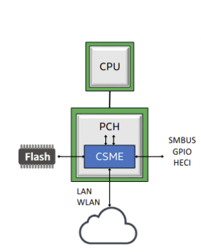

# Universidad Nacional de Córdoba
## FCEFyN - Sistemas de Computación 2024
## _Entrega #3: Modo Protegido_

Autores:
- Mangin, Matias Eduardo.
- Robles, Karen Yésica.
- Rodriguez, Luciano Ariel


## Comandos necesarios
```bash
sudo apt install qemu-system-x86
```
```bash
git clone
https://gitlab.unc.edu.ar/javierjorge/protected-mode-sdc.git
git submodule init 
git submodule update

./run bios_hello_world
./run protected_mode
```

Podemos modificar estos ejemplos 

```bash
// Dentro de x86-bare-metal-examples
vim bios_hello_world.S 
```
```
/* https://github.com/cirosantilli/x86-bare-metal-examples#bios-hello-world */

#include "common.h"

BEGIN
    mov $msg, %si
    mov $0x0e, %ah
loop:
    lodsb
    or %al, %al
    jz halt
    int $0x10
    jmp loop
halt:
    hlt
msg:
    .asciz "TP3 - Modo Protegido - SDC 2024"
```


## Desafios
### 1. UEFI y coreboot 
#### ¿Qué es UEFI? ¿cómo puedo usarlo? Mencionar además una función a la que podría llamar usando esa dinámica.
  
En primer lugar podríamos explicar que es una BIOS para entender cómo vino la UEFI.
La BIOS "Basic Input Output System" o "Sistema Básico de Entrada y Salida" es un sistema que se encarga de gestionar el arranque en los ordenadores introducido a mediados de los años 70. Este es el primero en cargarse y está encargado de iniciar, chequear y configurar los distintos componentes.
La UEFI, "Unified Extensible Firmware Interface" o "Interfaz de Firmware Extensible Unificada" es el sucesor del BIOS creada en el 2005, descrito como más seguro y más eficaz.
Para usar la UEFI⁹: Para utilizar un firmware UEFI, el hardware de tu disco debe soportar UEFI. Además, el disco del sistema tiene que ser un disco GPT. Si no es así, puedes convertir el disco MBR a GPT con un programa tipo Partition Magic profesional como MiniTool Partition Wizard .
Después de que termine la conversión, tendrás que cambiar el modo de arranque de BIOS a UEFI:

1- al encender la computadora accedemos a la configuración del sistema presionando la tecla “F10, F2, F12, F1 o SUPR” (dependiendo del ordenador ), aunque algunas computadoras tienen la posibilidad de presionar un pequeño botón externo.

2- Desde la pantalla principal de la BIOS, elige la sección Boot.

3- Cuando estés en Boot, elige el modo de arranque UEFI/BIOS y pulsa la
tecla intro.

4- En el cuadro de diálogo del modo de inicio UEFI/BIOS, elegir modo de
inicio UEFI y, a continuación, pulsar intro.

5- Guardar los cambios y salir.

6- repetir el paso 1 para entrar esta vez a la UEFI en vez de la BIOS

#### ¿Menciona casos de bugs de UEFI que puedan ser explotados?
Según algunas investigaciones, se indica que hay más de 23 vulnerabilidades listadas a continuación:

Las cuales podrían ser explotadas para instalar malware persistente, es decir que “sobreviva a las reinstalaciones del sistema operativo y permite eludir las soluciones de seguridad de punto final (EDR/AV), el arranque seguro y el aislamiento de seguridad basado en virtualización” ³.
Además estos problemas no pueden ser detectados por los sistemas de monitoreo de integridad del firmware.

#### ¿Qué es Converged Security and Management Engine (CSME), the Intel Management Engine BIOS Extension (Intel MEBx).?
El CSME significa Módulo de Gestión de Seguridad Convergente. “Es un subsistema dentro de los chips de Intel que viene integrado en las últimas generaciones de sus procesadores. El CSME es una característica de seguridad que se ejecuta al inicio y es responsable de verificar y autenticar todo el firmware posterior.” ¹ (Rus)
Este es un procesador de Intel independiente y de bajo consumo, que proporciona un entorno de ejecución aislado y protegido desde el SW del host que se ejecuta en la CPU principal.



Roles:
- Inicialización de Silicio:
Arranque seguro, configuración de clocks y carga de microcódigo en motores PCH/CPU HW
-Seguridad:
Ejecución aislada y confiable de servicios de seguridad (TPM, DRM, DAL)
-Gestión:
Gestión remota independiente del SO (AMT de Intel)

MEBx significa “extensión de BIOS del ME”.
MEBx proporciona “opciones de configuración a nivel de plataforma para poder configurar el Management Engine (ME). Las opciones incluyen la activación y desactivación de funciones individuales y el ajuste de las configuraciones de energía”

#### ¿Qué es coreboot ? ¿Qué productos lo incorporan ?¿Cuales son las ventajas de su utilización?
Inicialmente llamado LinuxBIOS, es un proyecto de código abierto cuyo fin es ofrecer las funciones más elementales al inicio del sistema para luego pasar a inicializar el hardware (es decir, reemplazar a la BIOS propietaria que viene de fábrica).
 Todos los productos ChromeOS incorporan coreboot, como también los de Star Labs, System76, NovaCustom, Purism y PC Engines. 
Además de ser rápido (fue diseñado con la intención de que realice su tarea con el mínimo de instrucciones posible) y seguro, su característica más importante es la de ser software libre, lo que permite tener un control máximo del producto, además de cumplir con los estándares de la Free Software Foundation.

### 2.LINKER

#### ¿Que es un linker? ¿que hace ? 
Un linker es un programa que crea un archivo ejecutable o biblioteca a partir de código objeto, típicamente la salida de un compilador.
Un enlazador de scripts (como el archivo link.ld) es un conjunto de comandos que definen qué partes de código objeto copiar y en qué orden.
- Los principales entre ellos son las secciones (fundamental, especifica la estructura del archivo binario en la salida) y la memoria (opcional, que describe la memoria disponible).
  
- Los comentarios, sintácticamente equivalentes a espacios en blanco y delimitados por / * y */, son similares a los de C89.
  
- La variable especial " . '' (contador de ubicación) le permite especificar la ubicación actual en la memoria en la que insertar el código objeto.
  
- La sintaxis proporciona varios operadores aritméticos y algunas funciones con las que construir expresiones.
  
- El comando SECTIONS solo se puede usar una vez en cada script, y le permite definir un número arbitrario de secciones. Cada sección tiene un nombre, seguido de dos puntos y un bloque entre corchetes que define su contenido.
  
#### ¿Que es la dirección que aparece en el script del linker?¿Porqué es necesaria ?
Corresponde a la dirección donde se almacena el registro de arranque principal (0x7C00).
Es necesario especificarla porque dicha estructura (la MBR) posee la tabla de particiones del disco y una pequeña porción de código ejecutable para el arranque, lo que significa una parte clave del sistema de inicio.

#### Compare la salida de objdump con hd, verifique donde fue colocado el programa dentro de la imagen. 
_Muestra el código fuente junto con el disassembly_
```
objdump -S 
```


_Analizando la salida del hd main.img se puede observar que el programa fue colocado en los bytes del MBR asignados al área de código de arranque (desde la posición 000h), Indicando que este codigo sera lo primero en ejecutar la BIOS, justo después de la instrucción hlt en 0xf4 se coloca la impresión del msg “Hello World”_


#### ¿Para que se utiliza la opción --oformat binary en el linker?
Permite especificar el formato binario de la salida del archivo objeto

### 3.MODO PROTEGIDO

#### ¿Cómo sería un programa que tenga dos descriptores de memoria diferentes, uno para cada segmento (código y datos) en espacios de memoria diferenciados?
La GDT deberá tener 2 entradas, una por cada descriptor de segmento correspondiente.

#### Cambiar los bits de acceso del segmento de datos para que sea de solo lectura, intentar escribir, ¿Qué sucede? ¿Qué debería suceder a continuación? Verificarlo con gdb.
En caso de que la tabla GDT se defina con segmento de datos de sólo lectura, cuando se intente escribir en la memoria el mensaje, se activará la bandera de interrupción IF, del registro EFLAGS, impidiendo la ejecución del código restante, quedando en un bucle infinito.

#### En modo protegido,¿Con qué valor se cargan los registros de segmento? Porque?
En la GDT se carga el offset para la entrada al descriptor de segmento, cada vez que hago un cambio de contexto.


En modo protegido, los registros de segmento CS, DS, SS, ES, FS, GS, contienen una estructura de datos más compleja que una simple dirección como en modo real, que contiene la base, que en conjunto con el offset nos permite obtener la dirección física.
En cambio en modo protegido, el registro de segmento está compuesto por el índice + el TI (indicador de tabla) + RPL (privilegio).
Con el índice podemos acceder a una tabla de descriptores que nos brinda información sobre la base, el límite y los atributos del segmento al que queremos acceder.
Como ahora tenemos registros como el RPL (registro de segmento) y el DPL (descriptor) nos permite implementar mecanismos de protección e introducir niveles de privilegio para el acceso a los datos.


Según el manual Intel 325384-053U parte 3 sección 3.4.2 “El procesador no utiliza la primera entrada de la GDT. Un selector de segmento que apunta a esta entrada de la GDT (que es decir, un selector de segmento con un índice de 0 y el indicador TI establecido en 0) se utiliza como un "selector de segmento nulo.”


### Desarrollo práctico 

#### Crear imagen booteable
En primer lugar necesitamos tener instalado “QEMU”, que básicamente es un emulador de sistema completo, es decir, incluye la emulación de procesador, periféricos,  etc. En este caso, lo virtualizamos en un entorno de Linux Mint.


#### Utilizando el repositorio de ejemplos
- Prueba de ejemplo simple MBR


- Ejemplo HelloWorld

Podemos observar que el texto “TP3 - Modo Protegido - SDC 2024” lo agregamos nosotros modificando el archivo bios_hello_world.S mediante un editor de código (VIM). 

- Ejemplo “Protected Mode” también con el texto editado


- Siguiendo los ejemplos del repositorio adjuntado al trabajo realizamos el debug de bios_hello_world con gdb:


- Ahora toca pasar esto a hardware real, para esto usamos un usb externo donde usamos gparted para formatear aunque no era necesario y cargamos la imagen de protected mode en el:


#### Crear un código assembler que pueda pasar a modo protegido (sin macros)

Proceso:
- Deshabilitar interrupciones.
- Cargar GDT.
- Fijar el bit mas bajo de CR0 en 1.
- Saltar a la seccion de 32b.
- Configurar segmentos.

Para seguir esto nos guiamos del repo de ejemplo ya que los macros de los mismos estan definidos en un header y nos facilito el proceso.


#### Cambiar los bits de acceso del segmento de datos para que sea de solo lectura,  intentar escribir, ¿Que sucede? ¿Que debería suceder a continuación? (revisar el teórico) Verificarlo con gdb. 

Para cambiar los bits de acceso del segmento de datos para que sea de solo lectura, se debe modificar la entrada correspondiente en la GDT.

```as
gdt_data:
    .word 0xffff
    .word 0x0
    .byte 0x0
    .byte 0b10010000  # Segmento de datos de solo lectura
    .byte 0b11001111
    .byte 0x0
```

podemos intentar escribir en modo lectura agregando 

```as
mov $DATA_SEG, %ax
mov %ax, %ds
mov $0xdeadbeef, %ebx
mov %ebx, some_data

some_data:
    .long 0

```


