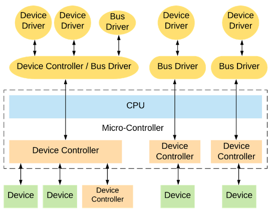
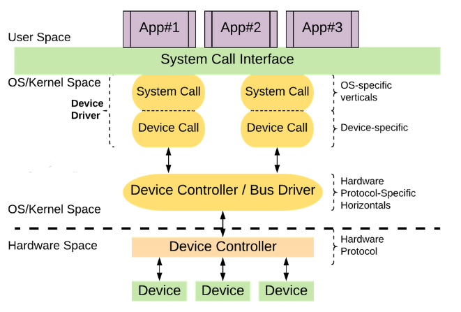
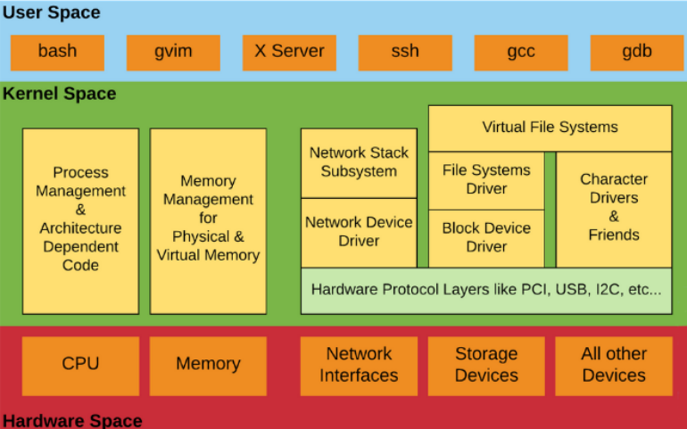
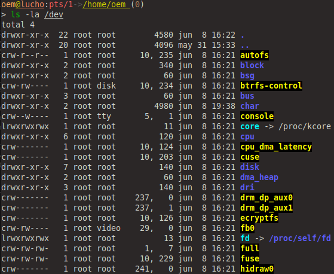

   

# Universidad Nacional de Córdoba
## FCEFyN - Sistemas de Computación 2024
## _Entrega #5: Drivers_

Autores:
- Mangin, Matias Eduardo.
- Robles, Karen Yésica.
- Rodriguez, Luciano Ariel

## Consigna

Para superar este TP tendrán que diseñar y construir un CDD que permita sensar dos señales externas con un periodo de UN segundo. Luego una aplicación a nivel de usuario deberá leer UNA de las dos señales y graficarla en función del tiempo. La aplicación tambien debe poder indicarle al CDD cuál de las dos señales leer. Las correcciones de escalas de las mediciones, de ser necesario, se harán a nivel de usuario. Los gráficos de la señal deben indicar el tipo de señal que se
está sensando, unidades en abcisas y tiempo en ordenadas. Cuando se cambie de señal el gráfico se debe "resetear" y acomodar a la nueva medición.

## ¿Qué es un driver?
Es un software que permite al sistema operativo interactuar con un periférico, creando una abtracción del hardware y proporcionando una interfaz para poder usarlo. Generalmente son construidos por los mismos fabricantes pero también se encuentran controladores libres, por ejemplo en los SO libres. En este ultimo caso, no son gente de los fabricantes pero puede haber cooperación lo que facilita el desarrollo.

## ¿ Cuantos tipos podemos encontrar ?
Comparando con un conductor en la vida real, el conductor puede ser una persona, o también un sistema automático. De la misma manera, un "Device Driver" puede ser pieza de software de otro periférico, posiblemente controlado por un software; en tal caso, se lo llama "Device Controller"

Un Device Controller es un device en sí mismo, y por lo tanto muchas veces también necesita un driver, comúnmente llamado "bus controller".

## Drivers & Buses
Los "bus drivers" nos dan una interfaz específica de hardware para los protocolos de hardware correspondientes. Además son las capas de software más bajas del SO (horizontales).

Sobre ellos se encuentran los "devices drivers" que operan sobre los dispositivos subyacentes usando las interfaces de capa horizontal, y por ende, son específicos del dispostivo.

   
  <em>Fig 1. Drivers & Buses.</em>

   
  <em>Fig 2. Una mirada horizontal.</em>

Basado en la interfaz específica del sistema operativo de un "driver", en Linux un driver se clasifica generalmente en tres verticales:
- Orientado a paquetes - Vertical "Network"
- Orientado a bloques - Vertical "Storage"
- Orientado a bytes - Vertical "Character"

   
  <em>Fig 3. Una mirada vertical.</em>

El directorio /dev contiene los archivos de dispositivos especiales para todos los dispositivos hardware.

   
  <em>Fig 4. /dev.</em>

## Character Devices

Ya sabemos qué son los drives y para que sirven. ¿Que tienen de especial los character devices? En resumen, que la mayoría de los controladores de dispositivos son de caracteres (recordemos que son orientados a bytes), por ejemplo, seriales, audio, video, cámara, etc.

