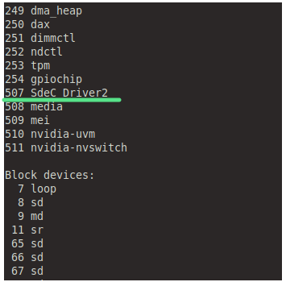

<p align="center">
  <br>
</p>

# Universidad Nacional de Córdoba
## FCEFyN - Sistemas de Computación 2024
## _Entrega #5: Drivers_

Autores:
- Mangin, Matias Eduardo.
- Robles, Karen Yésica.
- Rodriguez, Luciano Ariel


## Consigna

Para superar este TP tendrán que diseñar y construir un CDD que permita sensar dos señales externas con un periodo de UN segundo. Luego una aplicación a nivel de usuario deberá leer UNA de las dos señales y graficarla en función del tiempo. La aplicación tambien debe poder indicarle al CDD cuál de las dos señales leer. Las correcciones de escalas de las mediciones, de ser necesario, se harán a nivel de usuario. Los gráficos de la señal deben indicar el tipo de señal que se
está sensando, unidades en abcisas y tiempo en ordenadas. Cuando se cambie de señal el gráfico se debe "resetear" y acomodar a la nueva medición.

## ¿Qué es un driver?
Es un software que permite al sistema operativo interactuar con un periférico, creando una abtracción del hardware y proporcionando una interfaz para poder usarlo. Generalmente son construidos por los mismos fabricantes pero también se encuentran controladores libres, por ejemplo en los SO libres. En este ultimo caso, no son gente de los fabricantes pero puede haber cooperación lo que facilita el desarrollo.

## ¿ Cuantos tipos podemos encontrar ?
Comparando con un conductor en la vida real, el conductor puede ser una persona, o también un sistema automático. De la misma manera, un "Device Driver" puede ser pieza de software de otro periférico, posiblemente controlado por un software; en tal caso, se lo llama "Device Controller"

Un Device Controller es un device en sí mismo, y por lo tanto muchas veces también necesita un driver, comúnmente llamado "bus controller".

## Drivers & Buses
Los "bus drivers" nos dan una interfaz específica de hardware para los protocolos de hardware correspondientes. Además son las capas de software más bajas del SO (horizontales).

Sobre ellos se encuentran los "devices drivers" que operan sobre los dispositivos subyacentes usando las interfaces de capa horizontal, y por ende, son específicos del dispostivo.

<p align="center">
  <br>
  <em>Fig 1. Drivers & Buses.</em>
</p>

<p align="center">
  <br>
  <em>Fig 2. Una mirada horizontal.</em>
</p>

Basado en la interfaz específica del sistema operativo de un "driver", en Linux un driver se clasifica generalmente en tres verticales:
- Orientado a paquetes - Vertical "Network"
- Orientado a bloques - Vertical "Storage"
- Orientado a bytes - Vertical "Character"

<p align="center">
  <br>
  <em>Fig 3. Una mirada vertical.</em>
</p>

El directorio /dev contiene los archivos de dispositivos especiales para todos los dispositivos hardware.

<p align="center">
  <br>
  <em>Fig 4. /dev.</em>
</p>


## Character Devices

Ya sabemos qué son los drives y para que sirven. ¿Que tienen de especial los character devices? En resumen, que la mayoría de los controladores de dispositivos son de caracteres (recordemos que son orientados a bytes), por ejemplo, seriales, audio, video, cámara, etc.

## Nuestro primer CDD
Cualquier driver de Linux consta de un _constructor_ y un _destructor._
Se llama al constructor de un módulo cada vez que _insmod_ logra cargar el módulo en el núcleo. Se llama al descructor cada vez que _rmmod_ logra descargar el módulo del núcleo.

Se implementan dos funciones habituales en el driver con las macros _module_init()_ y _module_exit()_ incluidas en _module.h_.

```c
#include <linux/module.h>
#include <linux/version.h>
#include <linux/kernel.h>

static int __init drv1_init(void) /* Constructor */
{
    printk(KERN_INFO "SdeC: drv1 Registrado exitosamente..!!\n");

    return 0;
}

static void __exit drv1_exit(void) /* Destructor */
{
    printk(KERN_INFO "SdeC: drv1 dice Adios mundo cruel..!!\n");
}

module_init(drv1_init);
module_exit(drv1_exit);

MODULE_LICENSE("GPL");
MODULE_AUTHOR("Anil Kumar Pugalia <email@sarika-pugs.com>");
MODULE_DESCRIPTION("Nuestro primer driver de SdeC");
```
<p align="center">
  <br>
  <br>
  <br>
  <br>
  <em>Fig 4. insmod & rmmod drv1.</em>
</p>

## Número mayor y menor
El vínculo entre _APPLICATION_ y _CDF_ se basa en el nombre del archivo del dispositivo. En caso del vínculo _CDF - DD_ se basa en el número del archivo de dispositivo (NO en el nombre).

De esta manera, una aplicación de espacio de usuario tiene cualquier nombre para el CDF y permite que el núcleo tenga un enlace trivial CDF-DD basado en un índice.

Este índice se conoce como el par <major,minor > del archivo del dispositivo. 

A partir del kernel 2.6 en adelante hubo más recursos para el par:
- Tipos especiales: dev_t (contiene ambos numeros)
- Macros específicas:
  - MAJOR(dev_t dev) - El mayor de dev_t
  - MINOR(dev_t dev) - El menor de dev_t
  - MKDEV(int major, int minor) - Crea dev a partir de major y minor.

```c
#include <linux/module.h>
#include <linux/version.h>
#include <linux/kernel.h>
#include <linux/types.h>
#include <linux/kdev_t.h>
#include <linux/fs.h>

static dev_t first; 

static int __init drv2_init(void) /* Constructor */
{
    int ret;

    printk(KERN_INFO "SdeC_drv2 Registrado exitosamente..!!");

    // alloc_chrdev_region calcula (¿ obtiene ?) dinámicamente un MAJOR libre (se devuelve en 
    // first) y registra 3 números de device MINOR a partir de <el mayor libre, primer menor>, 
    // con el nombre SdeC_drv2. Si devuelve 0, está todo bien..!!

    if ((ret = alloc_chrdev_region(&first, 0, 3, "SdeC_Driver2")) < 0)
    {
        return ret;
    }
    printk(KERN_INFO "<Major, Minor>: <%d, %d>\n", MAJOR(first), MINOR(first));
    return 0;
}

static void __exit drv2_exit(void) /* Destructor */
{
    unregister_chrdev_region(first, 3);
    printk(KERN_INFO "SdeC_drv2 dice Adios mundo cruel..!!\n");
}

module_init(drv2_init);
module_exit(drv2_exit);

MODULE_LICENSE("GPL");
MODULE_AUTHOR("Cátedra Sistemas de Computación");
MODULE_DESCRIPTION("Nuestro segundo driver de SdeC");
```

<p align="center">
  <br>
  <br>
  <br>
  <br>
  <em>Fig 4. insmod drv2.</em>
</p>

## Creación automática de los CDF
Hasta el kernel 2.4, la creación de los archivos de dispositivos fue realizada automáticamente por el mismo kernel, usando api's de devfs. A medida que el kernel evolucionó, los desarrolladores se dieron cuenta que los DF son una cuestión más de espacio de usuario y que solo ellos deberían tratarlo, y no el kernel.

Con esa idea, el núcleo solo completa la clase de dispositivo y la información del dispositivo en _sys/class_. Luego el espacio de usuario necesita interpretarlo y tomar una acción apropiada. 

<p align="center">
  <br>
  <em>Fig 4. lsys.</em><br>
  <br>
  <em>Fig 4. interfaz wifi.</em><br>
  <br>
  <em>Fig 4. capacidad de la bateria.</em><br>
  <br>
  <em>Fig 4. temperatura.</em><br>
</p>
