# Universidad Nacional de Córdoba
## FCEFyN - Sistemas de Computación 2024
## _Entrega #4: Modulos de kernel_

Autores:
- Mangin, Matias Eduardo.
- Robles, Karen Yésica.
- Rodriguez, Luciano Ariel


## Desafio 1

### ¿Qué es checkinstall y para qué sirve?
CheckInstall es un programa informático para sistemas operativos tipo Unix que facilita la instalación y desinstalación de software compilado desde el código fuente mediante el uso de sistemas de gestión de paquetes. Después de la compilación del software, puede generar automáticamente un paquete compatible con Slackware , RPM o Debian que luego se puede desinstalar limpiamente a través del administrador de paquetes apropiado.

Los principales beneficios que ofrece CheckInstall en comparación con la simple ejecución make install son la capacidad de eliminar el paquete del sistema utilizando las herramientas de empaquetado del sistema y la capacidad de instalar el paquete resultante en varias máquinas.  CheckInstall a veces se cita como un mecanismo para crear paquetes mediante proyectos de código abierto en lugar de crear numerosos paquetes de compilación específicos de la plataforma.
### Empaquetar un hello world

### ¿ Qué funciones tiene disponible un programa ?
Cuando programamos, frecuentemente empleamos funciones que no hemos definido nosotros mismos, como por ejemplo `printf()`, que está provista por la biblioteca estándar de C, libc. Las definiciones de tales funciones no se incluyen en nuestro programa hasta la etapa de linkeo, en la que se garantiza que el código de la función `printf()` esté disponible y se corre la llamada a la instrucción para que apunte a ese código. Es decir un programa puede usar funciones definidas en librerias que luego en el momento del linkeo se agregan al programa.
### ¿ Qué funciones tiene disponible un modulo?
La definición de los símbolos proviene del propio kernel; las únicas funciones externas que puede utilizar un módulo, son las proporcionadas por el kernel. 

En algunos ejemplos se utiliza la funcion  `printk()`, pero no incluimos ninguna librería de entrada/salida. Esto es porque los modulos son archivos objeto cuyos símbolos se resuelven al hacer insmod.
### Espacio de usuario o espacio del kernel
Así como cada proceso tiene su espacio de memoria asignado, el kernel tiene su propio espacio de memoria. Y dado que los módulos pasan a formar parte del espacio de kernel, cuando fallan, falla el kernel.

El kernel gestiona principalmente el acceso a los recursos, ya sea una tarjeta de vídeo, un disco duro o una memoria. Los programas compiten por los mismos recursos. La función del kernel es mantener el orden, asegurando que los usuarios no accedan a los recursos de forma indiscriminada.

Para gestionar esto, las CPU funcionan en diferentes modos, cada uno de los cuales ofrece distintos niveles de control del sistema. Unix utiliza sólo dos de estos anillos: el anillo más alto (anillo 0, también conocido como `“modo supervisor”`, donde todas las acciones están permitidas) y el anillo más bajo, denominado `“modo usuario”`.

Cuando se utiliza una función de biblioteca en modo de usuario. La función de biblioteca llama a una o más llamadas al sistema, y estas llamadas al sistema se ejecutan en nombre de la función de la biblioteca, pero lo hacen en modo supervisor ya que son parte del propio kernel. Una vez que la llamada al sistema completa su tarea, regresa y la ejecución se transfiere nuevamente al modo de usuario.

### Espacio de datos.
Un programa en C, utiliza nombres de variables convenientes y con sentido para el lector. Si se escribe rutinas que serán parte de un gran programa, cualquier variable global que tenga es parte de una comunidad de variables globales de otras personas y algunos de los nombres pueden entrar en conflicto. Cuando existen muchas variables globales que no son lo suficientemente significativas para ser distinguidas, se contamina el espacio de nombres. En grandes proyectos, se debe hacer un esfuerzo para recordar nombres reservados y encontrar formas de desarrollar un esquema para nombres y símbolos únicos de variables.

Al escribir código del kernel, incluso el módulo más pequeño se vinculará con todo el kernel, por lo que esto definitivamente es un problema. La mejor manera de lidiar con esto es declarar todas sus variables como estáticas y usar un prefijo bien definido para sus símbolos. Por convención, todos los prefijos del kernel están en minúsculas. Si no desea declarar todo como estático, otra opción es declarar una tabla de símbolos y registrarla en el kernel. 

El archivo `/proc/kallsyms` contiene todos los símbolos que el kernel conoce y que, por lo tanto, son accesibles para sus módulos, ya que comparten el espacio de código del kernel.
### Drivers. Investigar contenido de /dev.
Un tipo de módulo son los device drivers, que proveen funcionalidades para hardware como un puerto serial. En UNIX, cada porción de hardware está representada por un archivo ubicado en `/dev` llamado device file, que provee una manera de comunicarnos con el hardware. El driver realiza la comunicación en nombre del usuario.

Por ejemplo, es1370.o puede ser el driver de una tarjeta de sonido, que conecta el archivo en `/dev/sound` a la tarjeta de sonido Ensoniq IS1379. Un programa en espacio de usuario como mp3blaster puede usar `/dev/sound` sin saber qué tarjeta de sonido está instalada.
### ¿Qué diferencias se pueden observar entre los dos modinfo ?
El comando modinfo muestra información detallada sobre el módulo del kernel especificado. Se puede consultar información sobre todos los módulos disponibles, independientemente  si están cargados o no. Las entradas de parm muestran los parámetros que el usuario puede establecer para el módulo, y qué tipo de valor esperan.
_Requisitos previos_: Tener instalado el paquete kmod.

Al ejecutar el comando `modinfo mimodulo.ko` se obtiene:
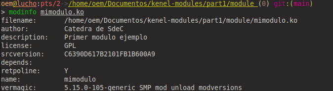
Revela una serie de atributos del módulo, incluyendo su ubicación en el sistema de archivos, el nombre del autor, una descripción del propósito del módulo (los cuales son cargados utilizando macros específicas), una identificación de versión representada por srcversion en forma de hash, las dependencias del módulo, su nombre y, por último, vermagic, que proporciona información sobre la compatibilidad del kernel y el compilador utilizados.

Luego se ejeucta el comando `modinfo /lib/modules/$(uname-r)/kernel/crypto/des_generic.ko`
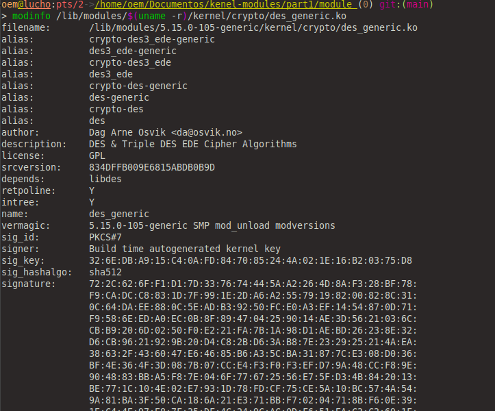
Se muestra información detallada sobre el módulo des_generic.ko. Este módulo se encarga de llevar a cabo tareas de encriptación, específicamente la implementación de los algoritmos DES (Data Encryption Standard) y Triple DES (3DES), los cuales son parte integral de la API de criptografía del kernel.
### ¿Qué divers/modulos estan cargados en sus propias pc?
Para visualizar los  drivers/módulos que están cargados en nuestra PC , utilizamos el comando `lsmod`
Este comando lista todos los módulos del kernel que están actualmente cargados en el sistema
```
sudo lsmod
```
Los módulos se almacenan dentro del archivo `/proc/modules` , por lo que también se pueden ver con:
```
sudo cat /proc/modules
```
Esta puede ser una lista larga y es posible que se prefiera buscar algo en particular. Por ejemplo para buscar el módulo fat :
`sudo lsmod | grep fat`
### ¿Qué diferencia existe entre un módulo y un programa ?
Un programa es una entidad independiente que se ejecuta en el espacio de usuario del sistema operativo. Se inicia mediante una función principal `main()` y, después de su ejecución, retorna el control al sistema operativo o al proceso que lo invocó. Los programas suelen proporcionar funcionalidades para el usuario final, como aplicaciones de software, utilidades del sistema, o scripts.

Por otro lado, un módulo del kernel se define con precisión como un segmento de código capaz de cargarse y descargarse dinámicamente dentro del kernel según sea necesario. Los módulos interactúan directamente con el kernel y tienen acceso a recursos de bajo nivel, como hardware y servicios del sistema. Se inicia mediante una función de inicialización `module_init()`, la cual comunica al kernel qué funcionalidad ofrece y lo prepara para ser utilizado cuando sea necesario. Los módulos pueden proporcionar controladores de dispositivos, sistemas de archivos adicionales u otras funcionalidades que extienden las capacidades del núcleo del sistema operativo.
### ¿Cómo puede ver una lista de las llamadas al sistema que realiza un simple helloworld en c?
### ¿Que es un segmentation fault? como lo maneja el kernel y como lo hace un programa?
Un "segmentation fault" (violación de segmento) es un error común en la programación que ocurre cuando un programa intenta acceder a una región de memoria que no le está permitida. Este error generalmente resulta en la terminación abrupta del programa.

Cuando ocurre una violación de segmento, el kernel del sistema operativo es el encargado de manejarla. El kernel detecta que el programa está intentando acceder a una dirección de memoria a la que no tiene permiso y toma acciones para evitar que el programa cause daño al sistema operativo o a otros programas en ejecución. Dependiendo del sistema operativo y la configuración del entorno, el kernel puede terminar el proceso que causó la violación de segmento y liberar los recursos asociados con él.

En cuanto a cómo maneja un programa una violación de segmento, generalmente no lo hace de forma explícita. Cuando ocurre una violación de segmento, el programa se detiene inmediatamente y puede generar un mensaje de error indicando la causa del fallo. Este mensaje de error puede ser útil para los desarrolladores para identificar y corregir el problema en el código del programa.
### Firma y documentacion de  un módulo de kernel 


### Ejemplo printf con makefile

```make
all:
	gcc -Wall -o ejemplo_printf ejemplo_printf.c 

clean:
	rm ejemplo_printf
```

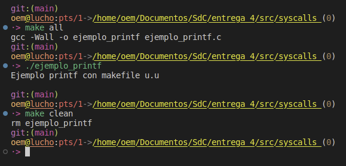

### run con strace
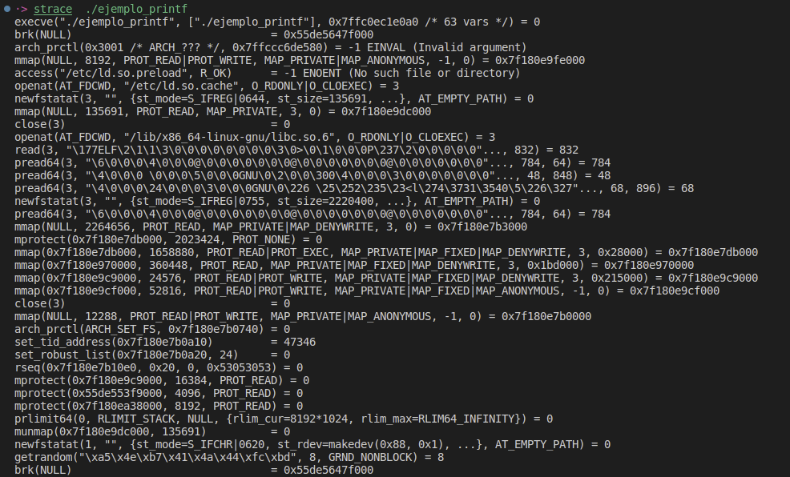
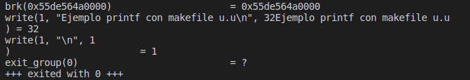
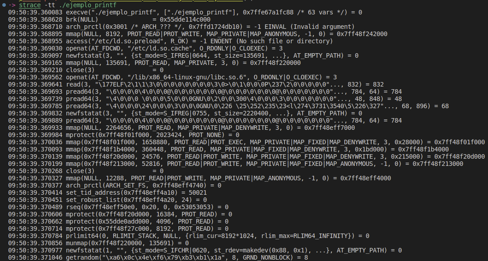
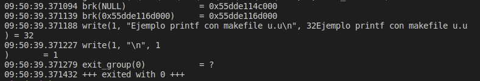
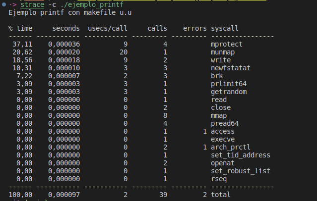

### /proc
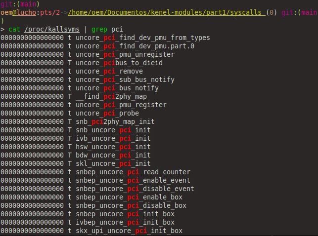
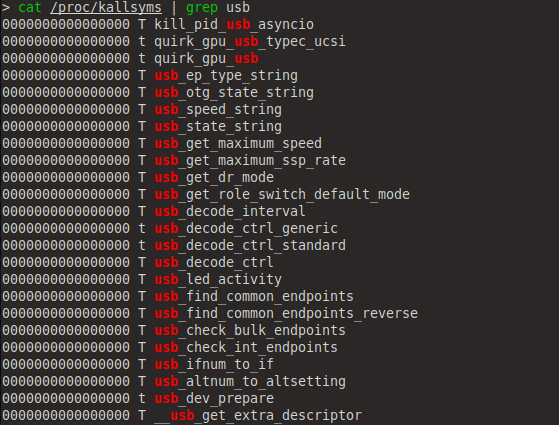

## Desafio 2
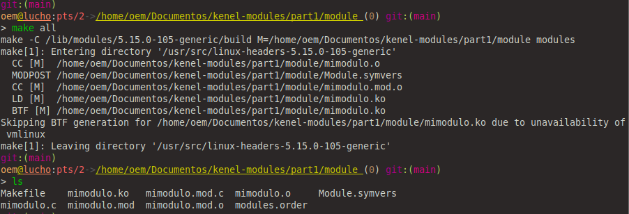

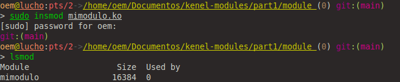
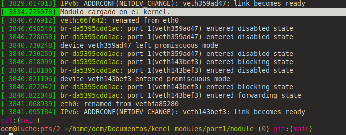
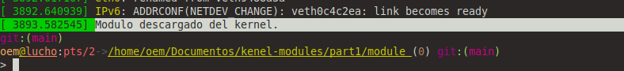
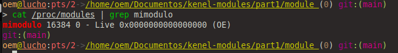

## Desafio 3 (pdf csroom)
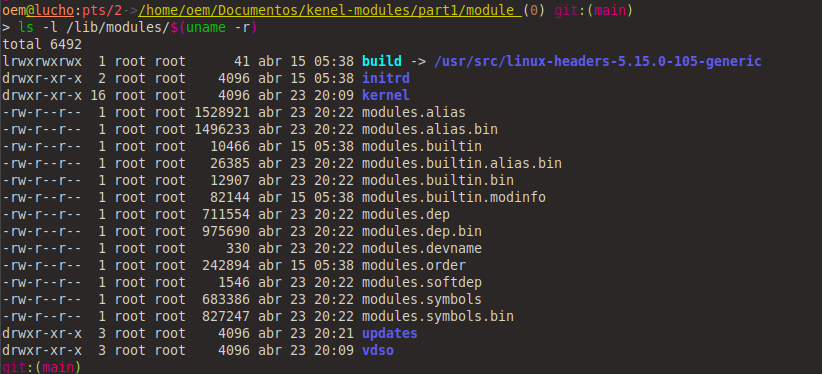
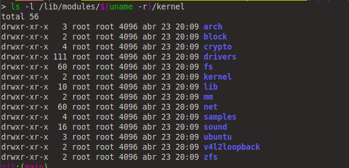
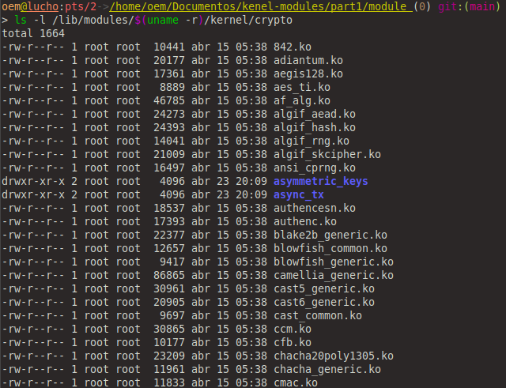
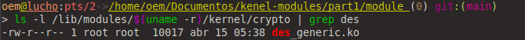

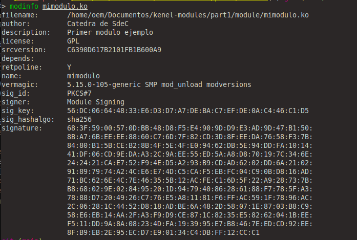
